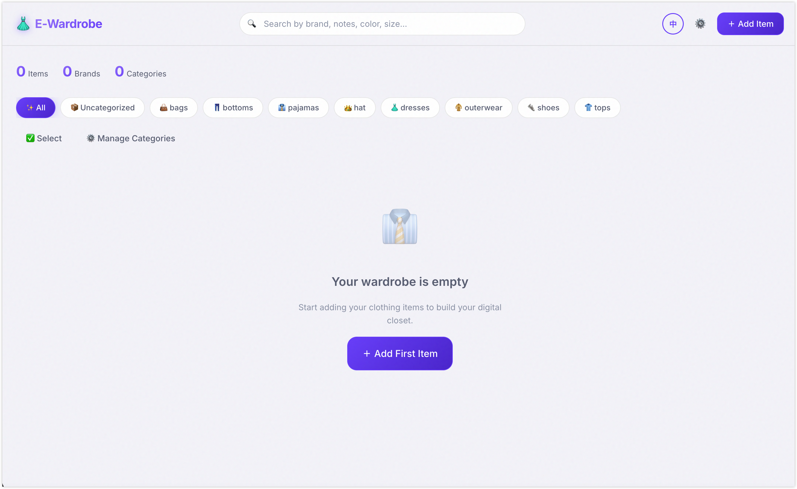

# E-Wardrobe — 你的数字衣橱

一款现代、精装的数字衣橱应用程序，用于整理你的服装收藏。你可以轻松上传照片、进行分类、添加详细备注，并快速搜索你整个衣橱的每一件衣物。




## 核心特性

- **图片管理**：支持通过拖拽上传和存储你的服饰照片。
- **分类过滤与管理**：按类型整理衣物。你可以动态地创建、编辑和删除自定义分类，以完美契合你的私人衣橱结构。
- **详细信息记录**：为每件衣物详细记录品牌、购买日期、尺码、颜色以及任意自定义的备注信息。
- **全局内容搜索**：实时关键字搜索，可瞬间跨品牌、备注、分类、颜色和尺码字段匹配出结果。
- **原生安全鉴权**：采用本地 SQLite 的 Cookie 会话认证机制。内置首次启动强制向导、应用级全局中间件拦截保护以及严格的强密码效验。
- **上传安全加固**：采用了深度的 Magic Bytes（文件底层特征码）验证核对，彻底丢弃被客户端伪造的文件名与 MIME 类型，从根本上杜绝隐藏在上传流程中的脚本木马（如图片木马）。配合前后端双重 10MB 体积验证。
- **现代轻量 UI**：玻璃拟物化设计 (Glassmorphism)、顺滑的微动画特效、自定义滚动条以及经过精心打磨的明亮系视觉系统。
- **国际化 (i18n)**：内置中英双语支持（默认中文），并能持久化保存配置到本地缓存中。
- **批量管理功能**：在总览视图提供响应式的多选操作栏，允许快速执行选定清理。

## 技术栈

- **前端框架**：[Next.js](https://nextjs.org/) (App Router 模式)
- **样式方案**：原生 Vanilla CSS 配合定制化的设计系统
- **数据库驱动**：基于 [better-sqlite3](https://github.com/WiseLibs/better-sqlite3) 的 SQLite 本地轻量化存储
- **文件存储**：本地文件系统 (`public/uploads/`)
- **国际化 (i18n)**：自主实现的无缝双语字典库

## 开始使用

### 环境要求

- Node.js 18+
- npm

### 安装

```bash
npm install
```

### 本地开发

```bash
npm run dev
```

在浏览器中打开 [http://localhost:3000](http://localhost:3000) 即可开始使用。

### 生产部署

```bash
npm run build
npm start
```

## 项目结构概览

```
e-wardrobe/
├── app/
│   ├── api/
│   │   ├── auth/                 # 原生身份认证路由（初始化、登录、登出、改密等）
│   │   ├── categories/route.js   # GET / POST 服装类目的核心接口
│   │   ├── categories/[id]/route.js # PUT / DELETE 编辑及删除自定义类目
│   │   ├── items/route.js        # GET (列表/搜索/过滤) + POST (添加衣服)
│   │   ├── items/[id]/route.js   # GET / PUT / DELETE 处理单件衣物的增删改
│   │   ├── items/batch-delete/   # POST 批量删除衣服的高层事务接口
│   │   └── upload/route.js       # POST 图片上传，负责处理硬盘存储与 Magic Bytes 安全校验
│   ├── login/                    # 独立的登录和管理引导初始化页面
│   ├── globals.css               # 设计系统参数与全局重置样式
│   ├── layout.js                 # 顶层 Layout 以及网页 metadata 声明
│   ├── page.js                   # 呈现数字衣橱交互的主面板组件
│   └── page.module.css           # 与主面板对应的作用域样式
├── lib/
│   ├── auth.js                   # 认证服务核心组件（如 scrypt 键派生加密算法，会话令牌颁发等）
│   ├── db.js                     # SQLite 本地数据库操作单例及架构初始化声明
│   └── i18n.js                   # 中英双语对照翻译字典
├── proxy.js                      # Next.js 应用层全局路由中间件 (拦截未经授权的页面及 API 请求)
├── public/uploads/               # 落地存储衣物图片的最终盘位 (被 gitignore 隔离)
└── data/                         # SQLite 的原生二进制库文件所在位置 (被 gitignore 隔离)
```

## 未来计划

- 图片的远程对象存储 (Remote Object Storage) 接入
- 日常穿搭（Outfit）的构建和搭配组合记录功能
- 穿着次数的数据统计以及对应季节的穿衣推荐
- AI 驱动的图片要素智能提取/自动标签化

## 开源协议

MIT
